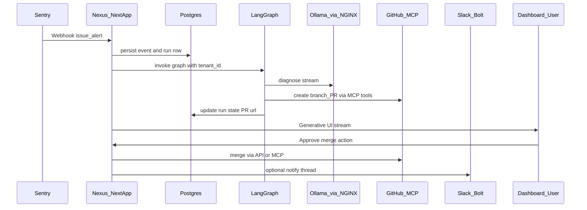

# Nexus — Phase 1 Architecture Spec

**Roadmap & phase status:** see [`IMPLEMENTATION.md`](IMPLEMENTATION.md).

**Stack (locked):** Bun · Next.js 15+ (App Router, Server Actions, PPR) · LangGraph.js · Ollama (via network) · Vercel AI SDK · PostgreSQL (Supabase/Neon) · Drizzle · Docker Compose · NGINX (Basic Auth for Ollama) · Slack Bolt (Socket Mode) · Sentry · MCP (GitHub, Sentry, Filesystem)

**Phase 1 scope:** schema, graph shape, routes, directory layout, compose, MCP wiring. No application UI or route handlers beyond this document.

---

## 1. High-level flow



---

## 2. Proposed directory structure (Bun + Next.js)

Optimized for App Router, server-only graph runners, and Docker.

```text
Nexus/
├── spec.md                          # This file
├── docker-compose.yml
├── Dockerfile                       # Phase 2: production image (Bun)
├── Dockerfile.dev                   # Optional: hot-reload dev container
├── bunfig.toml                      # Bun config (Phase 2)
├── package.json                     # Phase 2: next, ai, langgraph, drizzle, etc.
├── tsconfig.json
├── next.config.ts                   # cacheComponents (PPR via Cache Components), Sentry (Phase 2)
├── drizzle.config.ts
├── .env.example
├── .cursor/
│   └── mcp.json                     # MCP servers (Sentry, GitHub, Filesystem)
├── docker/
│   └── nginx/
│       ├── nginx.conf               # Reverse proxy + basic auth for Ollama upstream
│       └── README.md                # htpasswd generation
├── src/
│   ├── app/                         # Next.js App Router
│   │   ├── layout.tsx
│   │   ├── page.tsx                 # Dashboard shell (Phase 2)
│   │   ├── global-error.tsx         # Sentry boundary (Phase 2)
│   │   ├── api/
│   │   │   ├── health/route.ts
│   │   │   ├── webhooks/
│   │   │   │   └── sentry/route.ts
│   │   │   ├── slack/
│   │   │   │   └── events/route.ts  # Bolt ack if HTTP bridge; else Socket Mode worker
│   │   │   ├── runs/
│   │   │   │   ├── [runId]/route.ts # GET run detail (RSC / JSON)
│   │   │   │   └── [runId]/stream/route.ts # AI SDK stream for Generative UI
│   │   │   └── actions/             # Or use Server Actions under features/
│   │   └── (dashboard)/             # Route group: authenticated UI
│   │       ├── layout.tsx
│   │       ├── runs/[runId]/page.tsx
│   │       └── settings/page.tsx
│   ├── features/
│   │   ├── sentry-listener/         # Webhook verification, normalization, enqueue
│   │   ├── langgraph/
│   │   │   ├── graph.ts             # compile(checkpointer)
│   │   │   ├── state.ts             # Annotation / channels
│   │   │   └── nodes/               # One file per node
│   │   ├── github-automation/       # MCP client wrappers + REST fallback
│   │   ├── slack-bot/               # Bolt app, Socket Mode runner script
│   │   └── generative-ui/           # Vercel AI SDK UI pieces + tools
│   ├── lib/
│   │   ├── db/
│   │   │   ├── index.ts             # Drizzle client
│   │   │   ├── schema/              # Table modules
│   │   │   └── migrations/          # Drizzle Kit output
│   │   ├── auth/                    # Session, tenant resolution (Phase 2)
│   │   ├── ollama.ts                # Fetch to NGINX-protected Ollama URL
│   │   └── env.ts                   # Zod-validated env
│   └── workers/
│       ├── graph-runner.ts          # Bun worker / long-running process for graph steps
│       └── slack-socket.ts          # bolt(socketMode) entry
├── instrumentation.ts               # Sentry server init (Phase 2)
└── sentry.client.config.ts          # Phase 2
```

**Notes**

- **Bun** runs `next dev` / `next start` and standalone workers (`bun run workers/graph-runner.ts`).
- **PPR:** enable via **Cache Components** in `next.config.ts` (`cacheComponents: true`); replaces `experimental.ppr` in current Next.js releases (see [Next.js docs](https://nextjs.org/docs/app/api-reference/config/next-config-js/ppr)).
- **Multi-tenancy:** every query includes `tenant_id`; middleware resolves tenant from session or webhook secret mapping.

---

## 3. Database schema (Drizzle) — multi-tenant

All business tables include `tenant_id` (UUID, FK → `tenants.id`). Use `created_at` / `updated_at` where useful.

### 3.1 Core

| Table | Purpose |
|-------|---------|
| `tenants` | Organization row; slug, name, plan, `metadata` jsonb |
| `users` | Human users (email, auth subject from IdP) |
| `tenant_members` | `user_id`, `tenant_id`, `role` (owner, admin, member) |

### 3.2 Integrations (encrypted secrets in Phase 2; here columns only)

| Table | Purpose |
|-------|---------|
| `integration_sentry` | `tenant_id`, `org_slug`, `auth_token_ref`, `webhook_secret_hash`, `project_allowlist` jsonb |
| `integration_slack` | `tenant_id`, `team_id`, `bot_token_ref`, `app_id`, `signing_secret_hash` |
| `integration_github` | `tenant_id`, `installation_id` or PAT ref, `default_repo`, `org` |

### 3.3 Automation domain

| Table | Purpose |
|-------|---------|
| `sentry_events` | Raw + normalized payload: `tenant_id`, `sentry_issue_id`, `fingerprint`, `title`, `culprit`, `payload` jsonb, `received_at` |
| `automation_runs` | One LangGraph execution: `tenant_id`, `status` (queued, running, awaiting_approval, completed, failed), `sentry_event_id` FK, `graph_checkpoint_id`, `summary` text, `error` text |
| `run_steps` | Audit trail per node: `run_id`, `node_name`, `input_ref` jsonb, `output_ref` jsonb, `started_at`, `ended_at` |
| `pr_artifacts` | `run_id`, `tenant_id`, `branch`, `pr_number`, `pr_url`, `merge_status` |
| `human_approvals` | `run_id`, `tenant_id`, `decision` (approve, reject), `actor_user_id`, `payload` jsonb |
| `audit_log` | `tenant_id`, `actor_id`, `action`, `resource_type`, `resource_id`, `metadata` jsonb |

### 3.4 Indexes (minimum)

- `(tenant_id, created_at DESC)` on `automation_runs`, `sentry_events`
- Unique `(tenant_id, sentry_issue_id)` optional for dedupe strategy (product decision)

---

## 4. LangGraph.js — state and nodes

### 4.1 State (TypeScript `Annotation` / channels)

Suggested fields (all optional where not yet set):

| Field | Type | Description |
|-------|------|-------------|
| `tenant_id` | string | Resolved at webhook ingress |
| `sentry_event_id` | string | Internal DB id |
| `issue` | object | Normalized issue + stack snippets |
| `diagnosis` | string | Ollama output |
| `fix_plan` | object | Files, rationale, risk |
| `branch_name` | string | Created branch |
| `pr_url` | string | Open PR |
| `pr_number` | number | For merge action |
| `errors` | string[] | Soft failures per node |
| `awaiting_approval` | boolean | Human-in-the-loop gate |

Use a **checkpointer** (Postgres-backed for durability) keyed by `thread_id` = `automation_run.id`.

### 4.2 Nodes (graph)

| Node | Responsibility |
|------|----------------|
| `ingest_context` | Load `sentry_events` + optional MCP Sentry tools for extra context |
| `diagnose_ollama` | Stream/call Ollama (via `lib/ollama.ts` → NGINX URL + Basic Auth) |
| `plan_fix` | Structured JSON plan; validate with Zod |
| `mcp_github_prepare` | MCP: ensure branch from default, apply patch or commit API (strategy TBD in Phase 2) |
| `mcp_github_pr` | MCP: open PR with title/body from diagnosis |
| `notify_slack` | Post thread with run link (optional) |
| `human_gate` | **interrupt** until dashboard “Approve” writes `human_approvals` and resumes |
| `merge_pr` | On approval: merge via GitHub API (or MCP tool if available) |

**Edges:** linear with conditional edge from `human_gate` → `merge_pr` only after approval.

---

## 5. API route structure (App Router)

| Method | Path | Role |
|--------|------|------|
| GET | `/api/health` | Liveness for compose / k8s |
| POST | `/api/webhooks/sentry` | Verify signature; insert `sentry_events`; enqueue `automation_runs`; kick worker |
| POST | `/api/slack/events` | If using HTTP Events API; else Socket Mode worker only |
| GET | `/api/runs/[runId]` | Run + PR metadata (auth + tenant check) |
| GET | `/api/runs/[runId]/stream` | Vercel AI SDK stream for Generative UI |
| POST | `/api/runs/[runId]/approve` | Server Action or route: record approval, resume graph |

**Server Actions** (same feature, alternative surface): `approveRun(runId)`, `rejectRun(runId)` under `src/features/generative-ui/actions.ts`.

---

## 6. Docker & NGINX

- **Postgres:** single instance for dev; production → Supabase/Neon URL via env (compose override).
- **NGINX:** terminates Basic Auth and proxies to Ollama (host machine `host.docker.internal:11434` or LAN IP).
- **App:** Bun + Next.js image; `DATABASE_URL` points at `postgres` service.

See [`docker-compose.yml`](docker-compose.yml) and [`docker/nginx/README.md`](docker/nginx/README.md).

---

## 7. MCP (developer tooling)

Project-level config: [`.cursor/mcp.json`](.cursor/mcp.json).

- **Sentry:** remote OAuth server `https://mcp.sentry.dev/mcp` ([docs](https://docs.sentry.io/ai/mcp/)).
- **GitHub:** `@modelcontextprotocol/server-github` with `GITHUB_PERSONAL_ACCESS_TOKEN` (fine-scoped PAT for repos).
- **Filesystem:** `@modelcontextprotocol/server-filesystem` rooted at this repo for safe local edits.

Runtime Nexus app in Phase 2 may embed **MCP client** calls for GitHub/Sentry inside LangGraph tools (separate from Cursor’s MCP).

---

## 8. Sentry (application monitoring)

- Next.js SDK: `instrumentation.ts`, `sentry.client.config.ts`, edge/server configs.
- DSN via env; tag events with `tenant_id` (where permitted) for support.

---

## 9. Phase 2 checklist (out of scope for Phase 1)

- [ ] `bun create next-app` / manual scaffold with strict versions
- [ ] Drizzle migrate + seed `tenants`
- [ ] Implement webhook + graph runner worker
- [ ] Vercel AI SDK Generative UI + merge button
- [ ] Slack Bolt Socket Mode binary
- [ ] E2E test with fake Sentry payload

---

*Document version: Phase 1 — planning only.*
